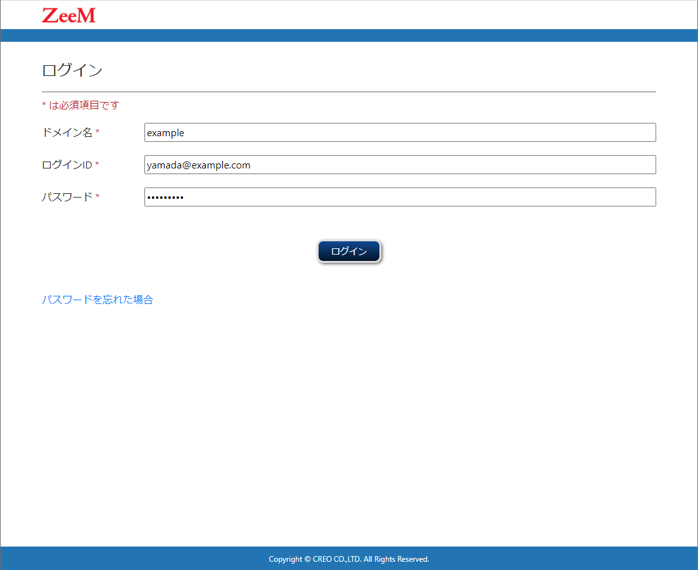
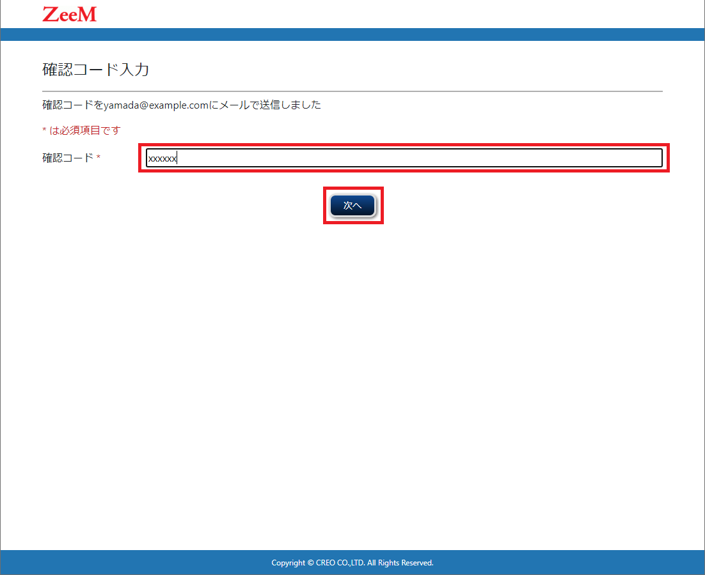
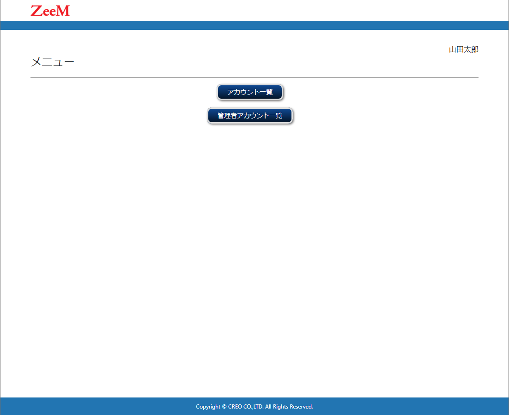

### 管理者ツール ログイン

管理者ツールへのログインを行います

#### ログイン画面へ遷移する
- Step1.　https://administrator.auth.zeem.jp/login にアクセスします
- Strp2.　ログインIDとパスワードを入力し、ログインボタンをクリックします
	・画面中の必須項目には\*がついています
	
|  項目名  |  内容  |
|:----:|:----:|
|  ドメイン名（必須項目）  |  導入/運用ツールで作成したドメイン名を指定します  |
|  ログインID（必須項目）  |  メールアドレス形式のログインIDを入力します  |
|  パスワード（必須項目）  |  パスワードを入力します  |

- Strp3.　確認コード入力画面が表示される場合はログインID（メールアドレス）に送信された確認コードを入力し、次へボタンをクリックしします
	・画面中の必須項目には\*がついています
	

- Strp3.　ログインが完了するとメニュー画面に遷移します
	